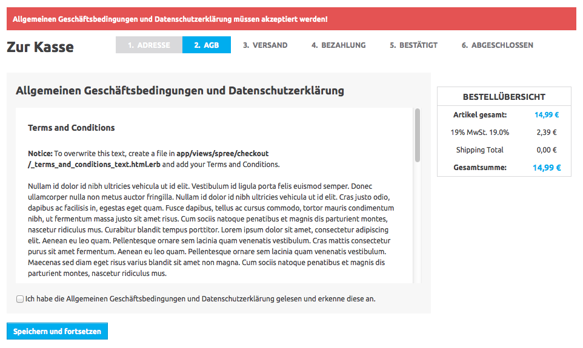

Spree Better Terms And Conditions
=============================

This gem adds a new "Terms and Conditions" step to your Order Checkout Flow. The user is required to mark an checkbox to validate that he/she read and accepted your Terms and Conditions.

In Germany you're legally required to let the user mark a checkbox for your Terms and Conditions (Allgemeine Geschäftsbedingungen / Datenschutzerklärung). Only if the user checked an previously unchecked checkbox, the acceptance of your Terms and Conditions is valid.

If you're searching for a simpler solution without the checkbox step, you should take a look at this extension: [frankmt/spree_terms_and_conditions](https://github.com/frankmt/spree_terms_and_conditions)

[](https://flattr.com/submit/auto?user_id=alks&url=https%3A%2F%2Fgithub.com%2Faleks%2Fspree_better_terms_and_conditions) 

Screenshot
------------



Installation
------------

Add spree_better_terms_and_conditions to your Gemfile:

```ruby
gem 'spree_better_terms_and_conditions'
```

Bundle your dependencies and run the installation generator:

```shell
bundle
bundle exec rails g spree_better_terms_and_conditions:install
```

Testing
-------

First bundle your dependencies, then run `rake`. `rake` will default to building the dummy app if it does not exist, then it will run specs. The dummy app can be regenerated by using `rake test_app`.

```shell
bundle
bundle exec rake
```

When testing your applications integration with this extension you may use it's factories.
Simply add this require statement to your spec_helper:

```ruby
require 'spree_better_terms_and_conditions/factories'
```

Copyright (c) 2014 [name of extension creator], released under the New BSD License
